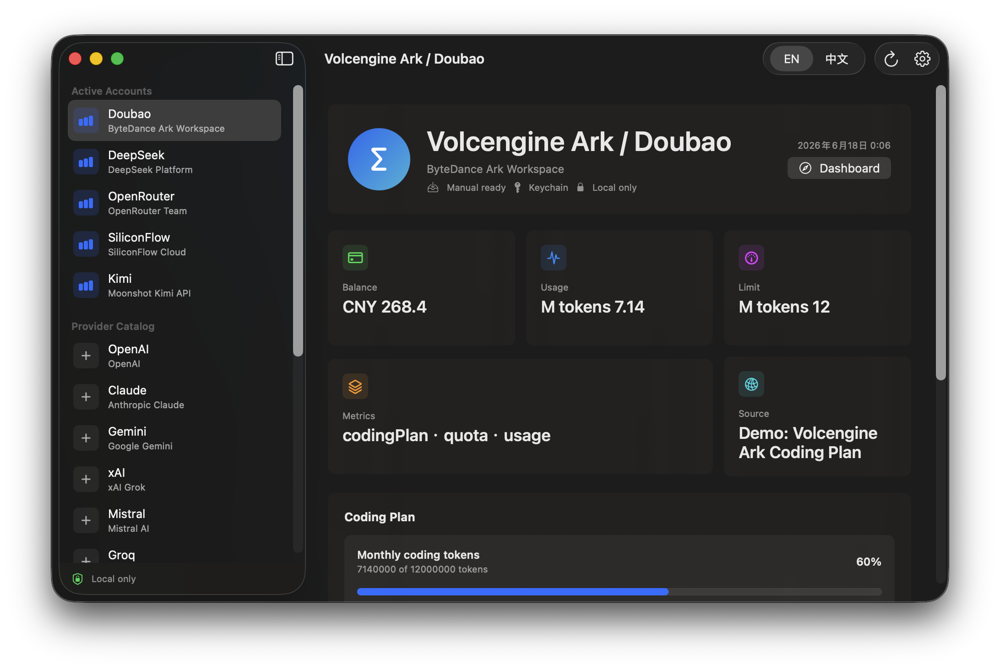
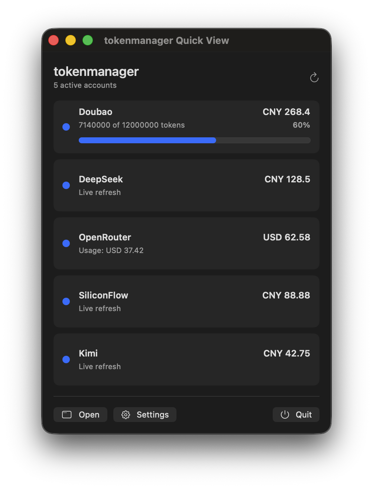
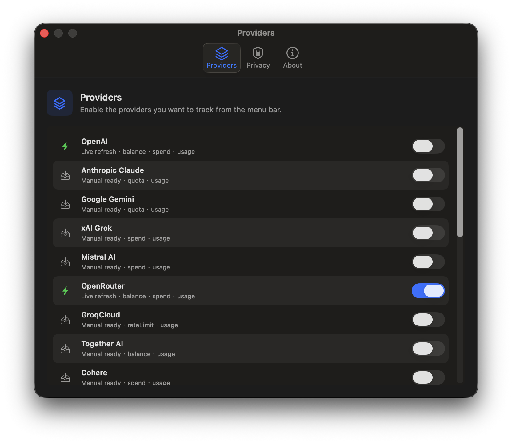

<div align="center">
  <h1>tokenmanager</h1>
  <p><strong>Local-first AI API balance, usage, quota, and Coding Plan tracking for the macOS menu bar.</strong></p>
</div>

<p align="center">
  <a href="https://github.com/autumncry/tokenmanager/actions/workflows/ci.yml"></a>
  
  
  
  <a href="LICENSE"></a>
</p>

<p align="center">
  
</p>

<p align="center">
  
  &nbsp;&nbsp;
  
</p>

## English

tokenmanager is a native macOS menu bar app for tracking usage across mainstream AI API platforms. It keeps provider API keys in macOS Keychain, stores only local configuration references, and refreshes data directly from this Mac to the provider APIs you enable.

The first release focuses on macOS-native quality: a menu bar quick view, a full dashboard window, local credential setup, provider discovery, bilingual UI controls, npm wrappers, and installer artifacts. The architecture keeps provider logic descriptor-driven so future Linux and Windows support can reuse the same core catalog, parser, and CLI layers.

### Highlights

- Native SwiftUI menu bar app with `MenuBarExtra`, dashboard window, Settings, and a compact Quick View.
- Local-only privacy model: no project server, no proxy, no cloud sync.
- macOS Keychain storage for provider keys and access tokens.
- JSON config at `~/.config/tokenmanager/config.json` with provider IDs, display names, refresh preferences, and Keychain references only.
- Provider catalog for OpenAI, Anthropic, Google Gemini, xAI, Mistral, OpenRouter, Groq, Together AI, Cohere, Azure OpenAI, AWS Bedrock, DeepSeek, Alibaba Bailian / Qwen, Volcengine Ark / Doubao, Zhipu BigModel, Moonshot / Kimi API, Baidu Qianfan, Tencent Hunyuan, SiliconFlow, MiniMax, StepFun, Baichuan, and ModelScope.
- Live refresh adapters for DeepSeek, Moonshot / Kimi API, SiliconFlow, OpenRouter, and OpenAI organization costs.
- Volcengine Ark / Doubao Coding Plan parser and demo data path for ByteDance-style coding quota windows.
- `tokenmanagerctl` CLI for provider discovery, status checks, and scripted local key setup.
- Installable as a macOS app bundle, `.pkg`, `.dmg`, or npm source-build wrapper.

### Install

Download the latest release assets from [GitHub Releases](https://github.com/autumncry/tokenmanager/releases):

- `tokenmanager-<version>.app.zip`
- `tokenmanager-<version>.pkg`
- `tokenmanager-<version>.dmg`

Source build:

```sh
git clone https://github.com/autumncry/tokenmanager.git
cd tokenmanager
./script/package_app.sh
open dist/tokenmanager.app
```

npm wrapper:

```sh
npm install -g tokenmanager
tokenmanager build
tokenmanager launch
```

CLI setup:

```sh
tokenmanagerctl providers
printf '%s' "$DEEPSEEK_API_KEY" | tokenmanagerctl config set-api-key --provider deepseek --stdin
tokenmanagerctl status
```

Build installer artifacts locally:

```sh
./script/make_pkg.sh
./script/make_dmg.sh
```

### Provider Coverage

| Provider | Metrics | Live refresh | Notes |
| --- | --- | --- | --- |
| OpenAI | spend, usage, balance | Yes | Uses organization cost APIs when the key has usage permissions. |
| DeepSeek | balance | Yes | Parses paid and granted balance breakdowns. |
| Moonshot / Kimi API | balance, usage | Yes | Parses cash and voucher balances. |
| SiliconFlow | balance, usage | Yes | Parses account identity and balance fields. |
| OpenRouter | credits, usage | Yes | Calculates remaining credits from total credits and usage. |
| Volcengine Ark / Doubao | usage, quota, Coding Plan | Demo parser | Includes Coding Plan quota windows and ByteDance aliases. |
| Alibaba Bailian / Qwen | usage, quota, Coding Plan | Catalog | Dashboard and API metadata included. |
| Zhipu, Baidu, Tencent, MiniMax, StepFun, Baichuan, ModelScope | usage, quota, balance | Catalog | Local/manual tracking now, provider adapters planned. |

Adding a provider usually means adding one descriptor, one parser/fetcher, tests, and documentation. See [docs/providers.md](docs/providers.md).

### Privacy

tokenmanager does not run or contact a tokenmanager-owned server.

- Credentials stay in macOS Keychain under service `app.tokenmanager.credentials`.
- Settings stay in `~/.config/tokenmanager/config.json`.
- Refresh calls go directly from your Mac to enabled provider APIs.
- Unsupported providers can still be enabled for local/manual tracking while live adapters are added.

See [docs/privacy.md](docs/privacy.md) for the full storage model.

### Development

Requirements:

- macOS 14+
- Xcode 26 or Swift 6.1+
- Node.js 18+ for npm wrapper validation

Run tests:

```sh
swift test
```

Launch from source:

```sh
./script/build_and_run.sh
```

Capture README screenshots from demo data:

```sh
./script/capture_screenshots.sh
```

Package release artifacts:

```sh
./script/package_app.sh
./script/make_pkg.sh
./script/make_dmg.sh
./script/make_app_zip.sh
```

### Project Layout

```text
Sources/TokenManagerCore   Provider catalog, parsers, config, Keychain, API client
Sources/TokenManagerApp    Native macOS menu bar app
Sources/TokenManagerCLI    tokenmanagerctl command-line helper
Tests/TokenManagerCoreTests
script                     Build, run, screenshot, pkg, dmg scripts
npm                        npm command wrappers
docs                       Privacy, provider, packaging, and screenshot notes
```

### Design

The first macOS UI pass is documented in an editable Figma design file:

[tokenmanager macOS v1 design](https://www.figma.com/design/qhIgYsAXchCeFjvajVMONu)

### Roadmap

- Native macOS menu bar app with dashboard, Settings, and Quick View.
- Local-only credential and config model.
- Mainstream global and Chinese provider catalog.
- Live adapters for DeepSeek, Moonshot, SiliconFlow, OpenRouter, and OpenAI costs.
- Volcengine Ark / Doubao Coding Plan parser and demo snapshot path.
- npm, `.app`, `.pkg`, and `.dmg` installation paths.
- Signed live adapters for Volcengine Ark, Alibaba Bailian, Zhipu, Baidu Qianfan, Tencent Hunyuan, MiniMax, StepFun, Baichuan, and ModelScope.
- Optional CLI-first Linux and Windows builds.
- Public website and notarized distribution pipeline.

## 中文

tokenmanager 是一个原生 macOS 菜单栏应用，用于追踪主流 AI API 平台的账户余额、用量、额度窗口和 Coding Plan。它把厂商 API Key 保存在 macOS 钥匙串，只在本地保存配置引用，并由你的 Mac 直接向已启用的厂商 API 发起刷新请求。

第一版优先保证 macOS 原生体验：菜单栏 Quick View、完整仪表盘窗口、设置页、本地密钥配置、厂商目录、中英界面切换、npm 包装命令，以及 `.app`、`.pkg`、`.dmg` 安装资产。核心层采用厂商描述符和解析器分离的架构，后续 Linux / Windows 支持可以复用同一套 catalog、parser 和 CLI。

### 亮点

- 原生 SwiftUI 菜单栏应用，支持 `MenuBarExtra`、仪表盘窗口、设置页和紧凑 Quick View。
- 本地优先隐私模型：没有项目服务器、没有代理、没有云同步。
- 厂商密钥和访问令牌保存到 macOS 钥匙串。
- JSON 配置位于 `~/.config/tokenmanager/config.json`，只保存厂商 ID、显示名、刷新偏好和钥匙串引用。
- 厂商目录覆盖 OpenAI、Anthropic、Google Gemini、xAI、Mistral、OpenRouter、Groq、Together AI、Cohere、Azure OpenAI、AWS Bedrock、DeepSeek、阿里百炼 / Qwen、火山方舟 / 豆包、智谱 BigModel、Moonshot / Kimi API、百度千帆、腾讯混元、SiliconFlow、MiniMax、阶跃星辰、百川智能和 ModelScope。
- 已支持 DeepSeek、Moonshot / Kimi API、SiliconFlow、OpenRouter 和 OpenAI organization costs 的实时刷新适配。
- 已加入火山方舟 / 豆包 Coding Plan 解析器与演示数据路径，可展示字节系 coding quota window。
- `tokenmanagerctl` CLI 可用于厂商查询、状态检查和脚本化本地密钥设置。
- 支持通过 macOS app bundle、`.pkg`、`.dmg` 和 npm source-build wrapper 安装。

### 安装

从 [GitHub Releases](https://github.com/autumncry/tokenmanager/releases) 下载最新版：

- `tokenmanager-<version>.app.zip`
- `tokenmanager-<version>.pkg`
- `tokenmanager-<version>.dmg`

源码构建：

```sh
git clone https://github.com/autumncry/tokenmanager.git
cd tokenmanager
./script/package_app.sh
open dist/tokenmanager.app
```

npm 安装路径：

```sh
npm install -g tokenmanager
tokenmanager build
tokenmanager launch
```

CLI 配置：

```sh
tokenmanagerctl providers
printf '%s' "$DEEPSEEK_API_KEY" | tokenmanagerctl config set-api-key --provider deepseek --stdin
tokenmanagerctl status
```

本地构建安装包：

```sh
./script/make_pkg.sh
./script/make_dmg.sh
```

### 厂商覆盖

| 厂商 | 指标 | 实时刷新 | 说明 |
| --- | --- | --- | --- |
| OpenAI | 花费、用量、余额 | 支持 | Key 具备用量权限时读取 organization cost API。 |
| DeepSeek | 余额 | 支持 | 解析充值余额与赠送余额明细。 |
| Moonshot / Kimi API | 余额、用量 | 支持 | 解析现金和券余额。 |
| SiliconFlow | 余额、用量 | 支持 | 解析账户身份与余额字段。 |
| OpenRouter | credits、用量 | 支持 | 根据总 credits 和 usage 计算剩余额度。 |
| 火山方舟 / 豆包 | 用量、额度、Coding Plan | 演示解析器 | 已包含 Coding Plan quota windows 和字节系别名。 |
| 阿里百炼 / Qwen | 用量、额度、Coding Plan | 目录支持 | 已包含控制台与 API 元数据。 |
| 智谱、百度、腾讯、MiniMax、阶跃星辰、百川、ModelScope | 用量、额度、余额 | 目录支持 | 当前支持本地/手动追踪，实时适配器规划中。 |

新增厂商通常只需要新增一个 descriptor、一个 parser/fetcher、测试和文档。详见 [docs/providers.md](docs/providers.md)。

### 隐私

tokenmanager 不运行、也不会联系 tokenmanager 自有服务器。

- 凭据保存在 macOS 钥匙串服务 `app.tokenmanager.credentials`。
- 设置保存在 `~/.config/tokenmanager/config.json`。
- 刷新请求从你的 Mac 直接发往已启用的厂商 API。
- 暂无实时适配器的厂商也可以启用为本地/手动追踪。

完整存储模型见 [docs/privacy.md](docs/privacy.md)。

### 开发

环境要求：

- macOS 14+
- Xcode 26 或 Swift 6.1+
- Node.js 18+，用于验证 npm 包装命令

运行测试：

```sh
swift test
```

从源码启动：

```sh
./script/build_and_run.sh
```

使用演示数据自动捕获 README 截图：

```sh
./script/capture_screenshots.sh
```

打包发布资产：

```sh
./script/package_app.sh
./script/make_pkg.sh
./script/make_dmg.sh
./script/make_app_zip.sh
```

### 项目结构

```text
Sources/TokenManagerCore   厂商目录、解析器、配置、钥匙串、API client
Sources/TokenManagerApp    原生 macOS 菜单栏应用
Sources/TokenManagerCLI    tokenmanagerctl 命令行工具
Tests/TokenManagerCoreTests
script                     构建、运行、截图、pkg、dmg 脚本
npm                        npm 命令包装
docs                       隐私、厂商、打包和截图说明
```

### 设计

第一版 macOS UI 已沉淀到可编辑 Figma 设计文件：

[tokenmanager macOS v1 design](https://www.figma.com/design/qhIgYsAXchCeFjvajVMONu)

### 路线图

- 原生 macOS 菜单栏应用，包含仪表盘、设置页和 Quick View。
- 本地优先凭据与配置模型。
- 覆盖国内外主流 AI 厂商的 provider catalog。
- DeepSeek、Moonshot、SiliconFlow、OpenRouter 和 OpenAI costs 实时适配。
- 火山方舟 / 豆包 Coding Plan 解析器与演示快照路径。
- npm、`.app`、`.pkg`、`.dmg` 安装路径。
- 火山方舟、阿里百炼、智谱、百度千帆、腾讯混元、MiniMax、阶跃星辰、百川和 ModelScope 的签名实时适配器。
- 可选的 Linux / Windows CLI-first 构建。
- 官网与 notarized 分发流水线。

## License

MIT. See [LICENSE](LICENSE).
